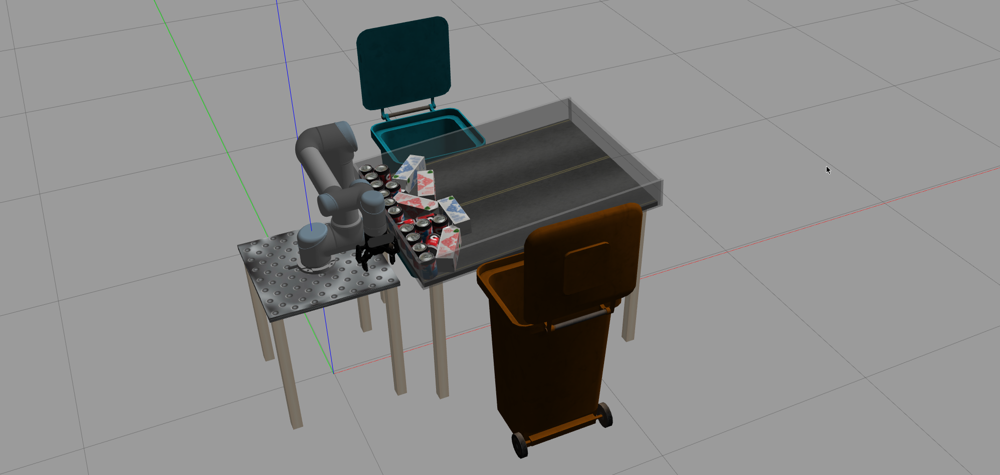

# Задания полуфинала олимпиады "Я - профессионал" 2024-2024 по робототехнике - Магистратура
[](https://t.me/iprofirobots) [](https://yandex.ru/profi/second_stage) [](mailto:iprofi.robotics@yandex.ru)





Репозиторий содержит ROS-пакет с минимальным *решением* задачи. Участнику следует, модифицируя этот пакет, решить задачу.

## Задача

Требуется разработать техническое решение, включая алгоритмическое и программное обеспечения системы управления и обработки сенсорной информации, для выполнения следующего сценария:

Дана роботизированная станция сортировки мусора, оснащенная манипулятором UR-5 с сенсорами модуля Intel RealSense.

Участникам предлагается с использованием доступного робота, реализовать алгоритм управления, который позволит выполнять сортировку объектов в соответствующие ячейки. Каждый тип мусора должен быть перемещен в соответствующую цветовой маркировке корзину для мусора, **алюминиевые банки в оранжевую корзину, пакеты Tetra pak в голубую корзину**.

Требуется реализовать программу на языках программирования С++ и/или Python реализующую решение задачи. 

В закрытых тестовых сценариях могут быть изменены конфигурация статических препятствий и исходное положение объектов для сортировки.

## Как все работает

Для решения задачи доступны два read-only docker-образа:

- [base] `registry.gitlab.com/beerlab/iprofi2024/problem/master/base-user:latest` -- включает все зависимости.

- [scene] `registry.gitlab.com/beerlab/iprofi2024/problem/master/scene:latest` -- собран на базе предыдущего и дополнительно включает файлы сцены в gazebo.

Запуск включает два шага:
- В контейнере сервиса `scene` на основе образа `[scene]` запускается сцена в симуляторе gazebo [scene_master](https://gitlab.com/beerlab/iprofi2024_dev/problem/master_scene).
- В контейнере сервиса `problem` на основе образа `[base]` запускается решение [solution_master](https://gitlab.com/beerlab/iprofi2024/problem/master).

Для автоматизации запуска запуска docker-контейнеров используется инструмент docker compose. Описание параметров запуска доступно в: `docker-compose.yml` и `docker-compose.nvidia.yml`.

*Note! Если вы используется систему с GPU от Nvidia используйте `docker-compose.nvidia.yml`*

*Note! Если вы используется систему с GPU от Nvidia используйте `docker-compose.nvidia.yml`*

## Установка и настройка окружения

Для настройки окружения необходимо иметь одну из перечисленных операционных систем:
1. Ubuntu 16.04 и старше
2. Windows 10 и старше, с установленным WSL2 (Не рекомендуется).

Для подготовки окружения необходимо сделать следующее:
1. Установить docker-engine: [Docker Engine](https://docs.docker.com/engine/install/ubuntu/).  
2. Также необходимо установить docker-compose-plugin: [Docker Compose](https://docs.docker.com/compose/install/linux/).  
3. Если вы планируете использовать видеокарту, установите также nviidia-container-toolkit: [Nvidia Container Toolkit](https://docs.nvidia.com/datacenter/cloud-native/container-toolkit/install-guide.html)
4. Добавить в группу docker пользователя

    ```bash
    sudo groupadd docker 
    sudo usermod -aG docker $USER 
    newgrp docker
    ```

## Как запустить начальное(базовое решение)
**Сделать форк репозитория**([как сделать форк](https://docs.gitlab.com/ee/user/project/repository/forking_workflow.html)) или **импорт**([как сделать импорт](https://docs.github.com/en/migrations/importing-source-code/using-github-importer/importing-a-repository-with-github-importer)) в случае использования Github.  
Установить параметр видмости: **Private**.  

Склонировать репозиторий:

```bash
git clone <ССЫЛКА НА ФОРК ИЛИ ИМПОРТ РЕПОЗИТОРИЙ РЕШЕНИЯ >
cd master
```

Дать права для подключения группе docker к дисплею хоста:

```
xhost +local:docker
```

Запустить сцену и ros-пакет из этого репозитория:

```bash
docker compose -f docker-compose.yml up --build --pull always
```
*Note!* В файле `docker-compose.yml` и `docker-compose.nvidia.yml` хранится описание параметров запуска сцены и решения.

### Редактирование базового решения
Для редактирования доступны все файлы в репозтории, за исключение файлов `docker-compose*.yml`.  
Чтобы начать решать задание вы можете отредактировать файл `start.launch` выбрав запуск python или C++ версии программы решения. 

Если вы пишете на python, нужно, чтобы в `start.launch` была раскомментирована строка: 

    <node name="example_node" pkg="master" type="example.py" output="screen"></node>

Если вы пишете на C++, нужно, чтобы в `start.launch` была раскомментирована строка: 

    <node name="example_node" pkg="master" type="example_node" output="screen"></node>

## Дополнительные полезные команды

В случае необходимости пересборки используйте флаг `--build`:

    docker compose -f docker-compose.yml up --build

Для получения последней версии сцены (обновления) используейте флаг `--pull always`:

    docker compose -f docker-compose.yml up --build --pull always

### Подключение в контейнер

Для открытия новой bash-сессии в сервисе решения: `problem` используйте команду:

    docker compose exec problem bash

Для открытия новой bash-сессии в сервисе сцены: `scene` используйте команду:

    docker compose exec scene bash

### Рестарт сцены или решения по отдельности
Для перезапуска **решения** используйте:

    docker compose restart problem

Для перезапуска **сцены** используйте:

    docker compose restart scene

## Отправка на тестирование
При отправке на тестирование убедитесь, что ваше решение не создает графических окон при установлении параметра `GUI=false` в `docker-compose.yml` или `docker-compose.nvidia.yml`, для этого при разработке программы, вы можете использовать переменную окружения `GUI` с помощью: 
```c++
std::string gui = std::getenv("GUI");
```
или для _Python3_:
```python3
gui = os.getenv('GUI')
```

## Оценка
Оценивается количество правильно отсортированных элементов мусора. Каждый элемент мусора должен быть перемещен в соответствующую зону (корзину) - такой сценарий перемещения считается успешным. 
- **Голубая** корзина соответствует **коробкам Tatra-Pak**
-**Оранжевая** корзина соответствует **алюминиевым банкам**

  - 1.0 балла – за каждый перемещенный элемент мусора в правильную зону
  - 0.5 балл штрафа – за каждый перемещенный элемент мусора в ошибочную зону 
  - 0.5 балл штрафа – за каждое столкновение с препятствиями
  
